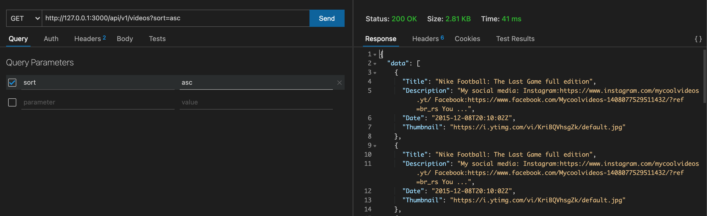

## Youtube API
Fetch latest videos sorted in reverse chronological order of their publishing date-time from YouTube for a given tag/search query in a paginated response.

## Tasks
- ~~Server should call the YouTube API continuously in background (async) with some interval (say 10 seconds)~~
- ~~fetching the latest videos for a predefined search query and should store the data of videos (specifically these fields - Video title, description, publishing datetime, thumbnails URLs and any other fields you require) in a database with proper indexes~~
- ~~A GET API which returns the stored video data in a paginated response sorted in descending order of published datetime~~
- ~~A basic search API to search the stored videos using their title and description~~
- ~~Dockerize the project~~
- Add support for supplying multiple API keys so that if quota is exhausted on one, it automatically uses the next available key.
- Make a dashboard to view the stored videos with filters and sorting options (optional)
- Optimise search api, so that it's able to search videos containing partial match for the search query in either video title or description. Ex 1: A video with title How to make tea? should match for the search query tea how

## Mockups

## Steps to Run

1. Clone the repo. `cd youtube-api-postgres`
2. Run `go mod tidy`
3. Create a `.env` file and put your `YOUTUBE_API_KEY`
4. Run `go run main.go`

## Maintainer
- [Ankit Hans](github.com/ankithans)